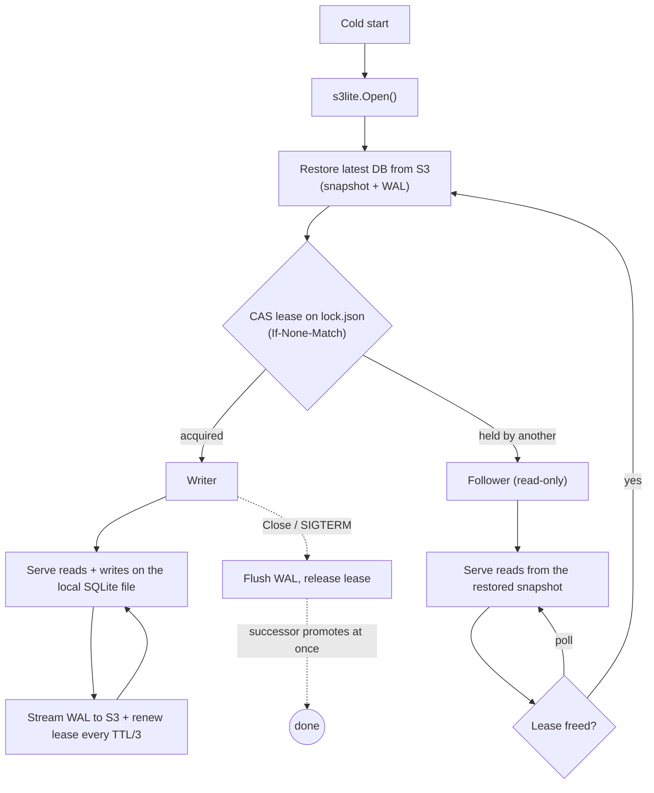

# s3lite

**A real database for serverless apps that idle to zero — backed by nothing but an object-store bucket.**

s3lite wraps [litestream](https://litestream.io) and a CGO-free SQLite driver so a plain container uses SQLite as a managed database: restore from S3 on startup, replicate to S3 continuously, and — via a lease built on the object store's own atomic conditional write — keep exactly one writer safe across restarts, deploys, and failover with no other moving parts. You get a standard `*sql.DB`.

## What it enables

Stateful services have long forced a choice:

- **stateless app + always-on managed DB** — scale the app to zero, but pay for and operate a Postgres/RDS that never sleeps, one network hop away; or
- **always-on stateful app** — keep a process or VM up just to hold data and stay correct.

s3lite dissolves that trade-off: the **only always-on, durable thing is the bucket** — and object storage is cheap, ubiquitous, fully managed, and free when idle. Your app becomes:

- **Scale-to-zero, yet transactional.** No state lives in the process — it restores from S3 on wake and replicates on write. Idle costs nothing, but every query hits a local ACID SQLite, not a network round-trip.
- **One binary + a bucket.** Nothing to provision. Ship the same container against AWS S3, Scaleway, Cloudflare R2, or MinIO — the bucket *is* the backing service.
- **Correct under concurrency, with no coordinator.** A compare-and-swap **lease on `lock.json`** (`If-None-Match`/`If-Match`) guarantees exactly one writer, so rolling deploys and failover are safe by construction — no Redis, etcd, or lock service. The object store *is* the coordinator.

> **Be clear about what the lease is — and isn't.** It buys single-writer safety and zero-downtime handoff: a new instance boots read-only and promotes only once the old one releases. It is **not** a turnkey read-replica cluster. Followers serve the snapshot they restored at startup and refresh only when they promote, and **nothing routes for you** — your app (or a load balancer) must direct writes to the leader and gate them on `IsLeader()`. Reading from followers scales only if stale-until-promotion data is acceptable. See [Single writer + read followers](#single-writer--read-followers-leasing).

Together that's a class of app you couldn't cleanly build before — **serverless, stateful, and correct at once**: deploy-anywhere services that need a genuine transactional store but no always-on infrastructure.

Proof by the hardest case: [gitmote](https://github.com/atmin/gitmote) is a *git remote* — concurrent pushes, correctness-critical, protocol-rigid — built entirely on s3lite, idling to zero between pushes. If a git server can run this way, ordinary CRUD apps trivially can. s3lite also runs in production behind [pan0.com](https://pan0.com).

## How it works

Every instance runs the same code; the lease decides who writes. The bucket holds the only durable state — a snapshot plus the replicated WAL.



Queries never leave the process — they hit the local file. S3 is touched only to restore on wake, stream the WAL, and arbitrate the lease. A hard kill can lose only the sub-second window since the last WAL sync; a clean `Close` loses nothing.

## How it compares

litestream is the replication engine s3lite embeds; a managed Postgres is what you'd otherwise reach for. The trade:

| | **s3lite** | litestream alone | managed Postgres |
|---|---|---|---|
| What it is | SQLite + litestream + a single-writer lease, in-process | A WAL-replication sidecar for SQLite | A networked RDBMS service |
| Durable state | Your S3 bucket | Your S3 bucket | The server's managed disk |
| Cost when idle | Zero — the app scales to zero | Zero, but you run the sidecar | Always-on (or slow serverless-PG cold starts) |
| Query path | Local file, in-process (no network hop) | Local file, in-process | Network round-trip per query |
| Single-writer safety | Enforced by the lease (handoff, failover) | **Not enforced** — you must guarantee one writer | N/A — real multi-writer |
| Concurrency & size | One writer; fits one node (KBs–GBs) | One writer; data fits one node | High concurrency; large datasets |
| Read replicas | Followers, **stale until promotion** (not live) | None | Real, live read replicas |
| Ops | A bucket | A bucket + supervise the sidecar process | Provision, patch, back up — or pay for managed |
| Best for | Single-writer apps (KBs to several GB) that want trivial deploy + automatic backup — idle-to-zero optional | Adding S3 durability to one existing SQLite process | Anything needing scale, concurrency, or big data |

The only hard limit is the single writer: reach for Postgres when you need genuine multi-writer concurrency or a dataset beyond one node. Size itself is fine — a multi-GB DB just pays a longer cold-start restore, so keep one instance warm if that first-request latency matters.

## Usage

```go
db, err := s3lite.Open(ctx, s3lite.Config{
    LocalPath:   "/tmp/db.sqlite3",
    RestoreFrom: "s3://my-bucket/db",
    BackupTo:    "s3://my-bucket/db",
    S3: s3lite.S3Config{
        Region:          os.Getenv("AWS_REGION"),
        Endpoint:        os.Getenv("AWS_ENDPOINT_URL"), // for MinIO/Scaleway/etc.
        AccessKeyID:     os.Getenv("AWS_ACCESS_KEY_ID"),
        SecretAccessKey: os.Getenv("AWS_SECRET_ACCESS_KEY"),
    },
    Migrations: []string{
        `CREATE TABLE IF NOT EXISTS users (id INTEGER PRIMARY KEY, email TEXT)`,
        `CREATE INDEX IF NOT EXISTS users_email ON users(email)`,
    },
})
if err != nil {
    log.Fatal(err)
}
defer db.Close()

// db embeds *sql.DB — use it directly
rows, err := db.QueryContext(ctx, "SELECT id, email FROM users")
```

Point `RestoreFrom` and `BackupTo` at the same URL — restore what you've been backing up. On first deploy the replica is empty; `Open` handles that as a no-op and starts with a fresh DB.

## Single writer + read followers (leasing)

litestream requires exactly one writer per replica. By default (`RoleOff`) s3lite
does not enforce that — every instance with `BackupTo` set replicates as a
writer, so you must guarantee a single instance yourself. Set `Config.Role` to
have s3lite enforce single-writer by a **lease** (litestream's `s3.Leaser`, stored
at `<BackupTo path>/lock.json`), so N instances run safely as one writer + many
read-only followers:

```go
db, err := s3lite.Open(ctx, s3lite.Config{
    LocalPath: "/tmp/db.sqlite3",
    BackupTo:  "s3://my-bucket/db", // leasing requires an s3:// replica
    S3:        s3cfg,
    Role:      s3lite.RoleAuto, // acquire the lease if free, else follow
    Migrations: []string{ /* ... */ },
})
...
if db.IsLeader() {
    // safe to write
}
db.OnPromote(func()      { /* started accepting writes */ })
db.OnDemote(func(err error) { /* stop accepting writes now */ })
```

Roles:
- **`RoleWriter`** — acquire the lease or fail `Open` with `*litestream.LeaseExistsError`.
- **`RoleFollower`** — open read-only, never replicate; promote to writer if the
  lease becomes free.
- **`RoleAuto`** — acquire if free (writer) else follow. The mode a serverless
  consumer wants: safe rolling deploys (handoff by lease), writer failover, and
  read scaling, all by construction.

The holder renews at `LeaseTTL/3` (default TTL 30s); a holder that cannot renew
**stops replicating immediately** (before the TTL could let anyone else acquire),
so two writers never overlap. `Close` releases the lease so a successor takes over
at once instead of waiting out the TTL.

Followers serve the snapshot they restored at `Open` and refresh on **promotion**
(a follower reopens after restoring the latest state before it starts writing);
continuous follower refresh is not yet implemented. Consequently a follower
replaces its embedded `*sql.DB` when it promotes — `RoleAuto`/`RoleFollower`
consumers should gate access on `IsLeader`/`OnPromote` rather than caching the
handle across a role change.

## Configuration

s3lite itself reads no environment variables. Pass S3 settings via `S3Config`.
Empty fields fall through to the AWS SDK's default credential chain (env vars,
`~/.aws/config`, IAM roles), so on EC2/ECS/Lambda you can leave credentials
blank and rely on the instance role.

## Limitations

- Single writer per replica. Enforce it yourself (one instance) or let s3lite
  enforce it with a lease — see [Single writer + read followers](#single-writer--read-followers-leasing).
- Restore happens on Open — cold starts pay this cost, proportional to DB size (sub-second for small DBs, longer for multi-GB). Keep one instance warm if a large-DB restore would hurt first-request latency.
- Followers serve their Open-time snapshot and only refresh on promotion;
  continuous follower refresh is not yet implemented.
- A clean `Close` is durable: it flushes all committed writes to the replica
  before returning (bounded by `Config.ShutdownSyncTimeout`, default 30s). Only a
  *hard* crash/kill can lose the sub-second window since litestream's last sync.
