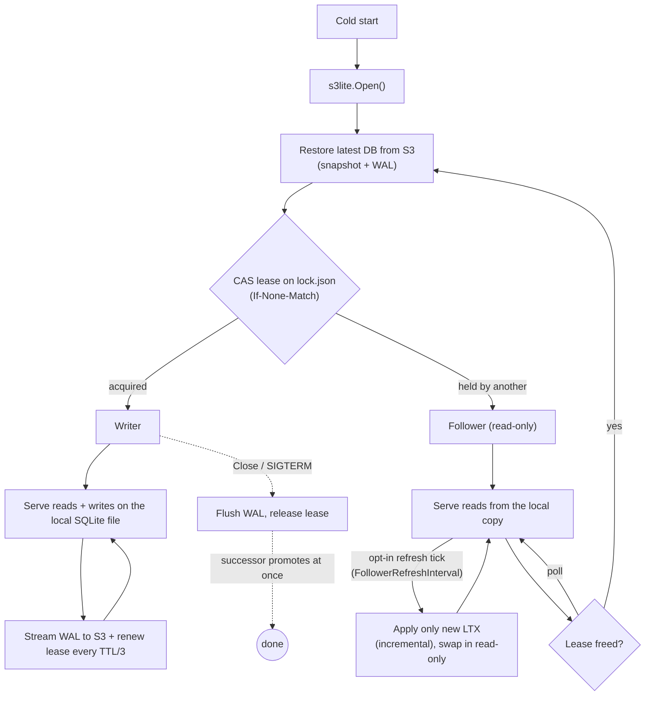

# s3lite

**A real database for serverless apps that idle to zero — backed by nothing but an object-store bucket.**

*Built for the developer who just wants to deploy their own thing: managed-grade durability at near-zero cost, with no database to babysit and no "which instance is the writer" incident to debug.*

s3lite wraps [litestream](https://litestream.io) and a CGO-free SQLite driver so a plain container uses SQLite as a managed database: restore from S3 on startup, replicate to S3 continuously, and — via a lease built on the object store's own atomic conditional write — keep exactly one writer safe across restarts, deploys, and failover with no other moving parts. You get a standard `*sql.DB`.

## What it enables

Stateful services have long forced a choice:

- **stateless app + always-on managed DB** — scale the app to zero, but pay for and operate a Postgres/RDS that never sleeps, one network hop away; or
- **always-on stateful app** — keep a process or VM up just to hold data and stay correct.

s3lite dissolves that trade-off: the **only always-on, durable thing is the bucket** — and object storage is cheap, ubiquitous, fully managed, and free when idle. Your app becomes:

- **Scale-to-zero, yet transactional.** No state lives in the process — it restores from S3 on wake and replicates on write. Idle costs nothing, but every query hits a local ACID SQLite, not a network round-trip.
- **One binary + a bucket.** Nothing to provision. Ship the same container against AWS S3, Scaleway, Cloudflare R2, or MinIO — the bucket *is* the backing service.
- **Correct under concurrency, with no coordinator.** A compare-and-swap **lease on `lock.json`** (`If-None-Match`/`If-Match`) guarantees exactly one writer, so rolling deploys and failover are safe by construction — no Redis, etcd, or lock service. The object store *is* the coordinator.

> **Be clear about what the lease is — and isn't.** It buys single-writer safety and zero-downtime handoff: a new instance boots read-only and promotes only once the old one releases. It is **not** a turnkey read-replica cluster. By default followers serve the snapshot they restored at startup and refresh only when they promote; set `FollowerRefreshInterval` to periodically catch up incrementally (applying only new LTX) for near-live, bounded-staleness reads (still not continuous live WAL streaming). And **nothing routes for you** — your app (or a load balancer) must direct writes to the leader and gate them on `IsLeader()`. Reading from followers scales only if bounded-staleness data is acceptable. See [Single writer + read followers](#single-writer--read-followers-leasing).

Together that's a class of app you couldn't cleanly build before — **serverless, stateful, and correct at once**: deploy-anywhere services that need a genuine transactional store but no always-on infrastructure.

Proof by the hardest case: [gitmote](https://github.com/atmin/gitmote) is a *git remote* — concurrent pushes, correctness-critical, protocol-rigid — built entirely on s3lite, idling to zero between pushes. If a git server can run this way, ordinary CRUD apps trivially can. s3lite also runs in production behind [pan0.com](https://pan0.com).

## How it works

Every instance runs the same code; the lease decides who writes. The bucket holds the only durable state — a snapshot plus the replicated WAL.


```mermaid
flowchart TD
    S[Cold start] --> O["s3lite.Open()"]
    O --> R["Restore latest DB from S3<br/>(snapshot + WAL)"]
    R --> L{"CAS lease on lock.json<br/>(If-None-Match)"}
    L -->|acquired| W[Writer]
    L -->|held by another| F["Follower (read-only)"]

    W --> WS[Serve reads + writes on the local SQLite file]
    WS --> WR[Stream WAL to S3 + renew lease every TTL/3]
    WR --> WS

    F --> FS[Serve reads from the local copy]
    FS -->|"opt-in refresh tick<br/>(FollowerRefreshInterval)"| FR["Apply only new LTX<br/>(incremental), swap in read-only"]
    FR --> FS
    FS --> FP{Lease freed?}
    FP -->|poll| FS
    FP -->|yes| R

    W -. "Close / SIGTERM" .-> C[Flush WAL, release lease]
    C -. successor promotes at once .-> X((done))
```

Queries never leave the process — they hit the local file. S3 is touched only to restore on wake, stream the WAL, and arbitrate the lease. A hard kill can lose only the sub-second window since the last WAL sync; a clean `Close` loses nothing.

## How it compares

litestream is the replication engine s3lite embeds; a managed Postgres is what you'd otherwise reach for. The trade:

| | **s3lite** | litestream alone | managed Postgres |
|---|---|---|---|
| What it is | SQLite + litestream + a single-writer lease, in-process | A WAL-replication sidecar for SQLite | A networked RDBMS service |
| Durable state | Your S3 bucket | Your S3 bucket | The server's managed disk |
| Cost when idle | Zero — the app scales to zero | Zero, but you run the sidecar | Always-on (or slow serverless-PG cold starts) |
| Query path | Local file, in-process (no network hop) | Local file, in-process | Network round-trip per query |
| Single-writer safety | Enforced by the lease (handoff, failover) | **Not enforced** — you must guarantee one writer | N/A — real multi-writer |
| Concurrency & size | One writer; fits one node (KBs–GBs) | One writer; data fits one node | High concurrency; large datasets |
| Read replicas | Followers; **opt-in near-live reads** (bounded-staleness refresh), or snapshot-until-promotion by default | None | Real, live read replicas |
| Ops | A bucket | A bucket + supervise the sidecar process | Provision, patch, back up — or pay for managed |
| Best for | Single-writer apps (KBs to several GB) that want trivial deploy + automatic backup — idle-to-zero optional | Adding S3 durability to one existing SQLite process | Anything needing scale, concurrency, or big data |

The only hard limit is the single writer: reach for Postgres when you need genuine multi-writer concurrency or a dataset beyond one node. Size itself is fine — a multi-GB DB just pays a longer cold-start restore, so keep one instance warm if that first-request latency matters.

## Usage

```go
db, err := s3lite.Open(ctx, s3lite.Config{
    LocalPath:   "/tmp/db.sqlite3",
    RestoreFrom: "s3://my-bucket/db",
    BackupTo:    "s3://my-bucket/db",
    S3: s3lite.S3Config{
        Region:          os.Getenv("AWS_REGION"),
        Endpoint:        os.Getenv("AWS_ENDPOINT_URL"), // for MinIO/Scaleway/etc.
        AccessKeyID:     os.Getenv("AWS_ACCESS_KEY_ID"),
        SecretAccessKey: os.Getenv("AWS_SECRET_ACCESS_KEY"),
    },
    Migrations: []string{
        `CREATE TABLE IF NOT EXISTS users (id INTEGER PRIMARY KEY, email TEXT)`,
        `CREATE INDEX IF NOT EXISTS users_email ON users(email)`,
    },
})
if err != nil {
    log.Fatal(err)
}
defer db.Close()

// db embeds *sql.DB — use it directly
rows, err := db.QueryContext(ctx, "SELECT id, email FROM users")
```

Point `RestoreFrom` and `BackupTo` at the same URL — restore what you've been backing up. On first deploy the replica is empty; `Open` handles that as a no-op and starts with a fresh DB.

## Single writer + read followers (leasing)

litestream requires exactly one writer per replica, and s3lite enforces that with
a **lease** whenever it replicates to S3 — an `s3://` `BackupTo` is *always* leased
(litestream's `s3.Leaser`, stored at `<BackupTo path>/lock.json`), so N instances
run safely as one writer + many read-only followers. There is no uncoordinated
"write to a shared WAL without a lease" mode. `Config.Role` only selects *how* an
instance coordinates:

```go
db, err := s3lite.Open(ctx, s3lite.Config{
    LocalPath: "/tmp/db.sqlite3",
    BackupTo:  "s3://my-bucket/db", // an s3:// replica is always leased
    S3:        s3cfg,
    Role:      s3lite.RoleAuto, // the default: acquire the lease if free, else follow
    Migrations: []string{ /* ... */ },
})
...
if db.IsLeader() {
    // safe to write
}
db.OnPromote(func()      { /* started accepting writes */ })
db.OnDemote(func(err error) { /* stop accepting writes now */ })
```

Roles:
- **`RoleAuto`** *(default)* — acquire if free (writer) else follow. The mode a
  serverless consumer wants: safe rolling deploys (handoff by lease), writer
  failover, and read scaling, all by construction. With no `s3://` replica (an
  unreplicated or `file://` DB) it degrades to the sole writer.
- **`RoleWriter`** — acquire the lease or fail `Open` with `*litestream.LeaseExistsError`.
- **`RoleFollower`** — open read-only, never replicate; promote to writer if the
  lease becomes free.

`RoleWriter` and `RoleFollower` demand a lease, so `Open` fails without an `s3://`
`BackupTo`. Without an `s3://` replica there is no shared WAL to coordinate on, so
the instance is simply the sole writer — leasing is neither needed nor possible.

The holder renews at `LeaseTTL/3` (default TTL 30s); a holder that cannot renew
**stops replicating immediately** (before the TTL could let anyone else acquire),
so two writers never overlap. `Close` releases the lease so a successor takes over
at once instead of waiting out the TTL.

A follower normally promotes only when the background loop next polls (every
`LeaseTTL/3`). To skip that wait, a consumer can call `TryPromote` on the write
path so a request that arrives during a handoff blocks for the restore and then
serves, instead of being refused until the next poll:

```go
if !db.IsLeader() {
    if ok, err := db.TryPromote(ctx); err != nil || !ok {
        http.Error(w, "no writer available", http.StatusServiceUnavailable)
        return
    }
}
// now the writer — safe to write
```

`TryPromote` attempts to acquire the lease immediately: it returns `true` if this
instance is (or, after restoring the latest replica, has just become) the writer,
and `false` if the lease is still held by a live writer elsewhere (e.g. after a
hard kill, until the old lease expires). It never promotes two writers —
acquisition is the same lease CAS the loop uses — and is safe to call
concurrently. It is strictly additive: an instance that never calls it is
unchanged.

### Release-on-idle: `YieldLease` + `OnDemandPromotion`

By default the holder is **sticky**: it renews until it dies, deploys, or `Close`s, so
a live-but-idle holder pins the lease and a peer's write is refused (read-only) until a
handoff. For a **bursty, migratory writer** — write where you are, read everywhere — you
can invert that: hold the lease only while actively writing, and let whoever writes next
acquire instantly.

```go
db, _ := s3lite.Open(ctx, s3lite.Config{
    // ...
    Role:              s3lite.RoleAuto,
    OnDemandPromotion: true, // followers promote only via TryPromote, not in the background
})

// on the write path:
if !db.IsLeader() {
    if ok, err := db.TryPromote(ctx); err != nil || !ok { /* 503: no writer available */ }
}
// ... serve the write ...

// when the instance goes idle (the consumer decides), hand the lease back:
if err := db.YieldLease(ctx); err != nil && !errors.Is(err, s3lite.ErrNotLeader) {
    // an aborted yield (replica outage) left us still the leader; try again later
}
```

`YieldLease` performs a **safe voluntary handoff** and keeps the instance alive as a
read-only follower: it fences the handle, does a final durable sync, stops replication,
records a clean-shutdown marker, and only then deletes the lock — so a peer acquiring
right after sees every acked write (single-writer is never violated). If the final sync
can't complete before the lease deadline the yield **aborts atomically**: the instance
stays the leader with renewals running, or — if it can no longer hold the lease — takes
the standard demote path. A successful yield never fires `OnDemote` (it is a
relinquishment, not a lost lease); it returns `ErrNotLeader` if the instance is not the
current holder. A yielded instance that later re-promotes with no interim writer resumes
in place (no re-download); one that finds a peer wrote in between restores.

`OnDemandPromotion` is what makes a yield worthwhile: without it, this instance's own
background loop (or an idle peer's) re-acquires the just-freed lock within a tick, so the
system ping-pongs restores. With it, a follower promotes **only** via an explicit
`TryPromote` on your write path, so the lock stays free between bursts. `Open`'s direct
acquire is unchanged (bootstrap and crash re-entry still work), and a crashed ex-leader
that may hold an unshipped tail keeps recovering eagerly rather than parking it — so
on-demand mode never turns a crash into silent data loss. Use the two together; a bare
`YieldLease` without `OnDemandPromotion` is self-defeating.

Followers serve the snapshot they restored at `Open` and always refresh on
**promotion** (a follower restores the latest state before it starts writing). To
also serve **near-live reads**, set `Config.FollowerRefreshInterval`: the follower
then periodically catches up to the leader's latest committed state and swaps it in
read-only, with staleness bounded by roughly the interval plus the leader's
replication lag. The catch-up is **incremental** — each tick fetches and applies only
the LTX committed since the follower's position, not a full snapshot — so a large
database on a short interval stays cheap. A tick that finds nothing new does no work,
so idle followers are cheap too; register `OnRefresh` to bust caches when new state
lands. Left at zero (the default) a follower serves only its `Open` snapshot —
unchanged behaviour. The refresh replaces the local file underneath the stable handle,
so a read that is in flight at the swap may see a rare, retryable error (the connection
is dropped and re-dialed); keep the interval modest and retry.

`db.Refresh(ctx)` is the same catch-up on demand: it pulls the replica's latest state
synchronously and reports whether anything advanced, so a request handler (or an
interactive shell) can force freshness right before a read instead of living with the
interval — and it works with `FollowerRefreshInterval` unset, since that setting is the
background cadence, not a prerequisite. It never takes the writer role (that is
`TryPromote`) and costs two listings on a reused client when the replica has not moved,
so calling it per read is affordable:

```go
if _, err := db.Refresh(ctx); err != nil {
    return err // the follower keeps serving its current state
}
row := database.QueryRowContext(ctx, "SELECT ...")
```

> The incremental refresh depends on a small litestream fork (a follow-mode
> resume fix); see [docs/litestream-fork.md](docs/litestream-fork.md).

The embedded `*sql.DB` is **stable for the life of the instance** — it is created
once and never reassigned, even across promote/demote. Take it once
(`database := db.DB`), pass it to your repositories, and keep using it:
connections are transparently re-dialed against the current file in the current
mode. A follower's handle is read-only (`query_only`), so if you serve traffic
before promotion, gate *write* paths on `IsLeader`; you never need `IsLeader` or
`OnPromote` merely to keep a handle valid.

On demotion the handle is fenced: new writes, writes on a checked-out `*sql.Conn`,
and the `Commit` of a transaction begun while leader are all rejected, so a demoted
writer cannot persist locally on a lease it no longer holds. Two foot-guns are on
you, not the library:

- **Do not call `Close` from an `OnPromote`/`OnDemote`/`OnRefresh` callback.** Those
  callbacks run on the internal lease-loop goroutine, and `Close` blocks waiting for
  that goroutine to exit — calling it from inside a callback deadlocks. (An `OnRefresh`
  fired by an explicit `Refresh` runs on the calling goroutine, but keep the rule.)
- **Do not defeat `query_only` on a follower** (e.g. `PRAGMA query_only=0`). A
  follower's local writes never replicate and are silently destroyed by the next
  restore or refresh.

A consumer that keeps state *derived* from the database — caches, externally stored
blobs, queued deletions — needs to tell two writer-entry outcomes apart: a **restore**,
where the local file was replaced by the replica (a takeover; the previous holder's
un-synced tail is gone — see the loss window under [Limitations](#limitations)) and must
be treated as a possible **rewind**; versus a **resume in place**, where the local
committed tail was kept (a same-machine restart) and nothing was discarded. Both advance
the generation, so `Generation()` alone conflates them. `LastPromoteOutcome()` reports
which happened:

```go
db.OnPromote(func() {
    if out, _ := db.LastPromoteOutcome(); out.Restored {
        // possible rewind: pause GC / destructive maintenance and reconcile
        // derived state before trusting the metadata again
        reconcile()
    }
})
```

It reflects the most recent writer entry — valid (`ok == true`) after a writer `Open`
and after each promotion, `false` on a follower that has never promoted — and covers
both entry paths (a loop/`TryPromote` promotion and a direct acquire at `Open`). A
first-ever writer entry with no prior local file reads as restored, erring the same
conservative direction as the fork guards. It is purely a signal: it changes no restore
decision, only lets a consumer skip the reconciliation pass on a plain restart.

## Client-side encryption (the bucket never sees plaintext)

Set `Config.EncryptionKey` and every LTX object s3lite ships is encrypted **before it
leaves the process**, under a key only your app holds. This is for a threat model that
includes the bucket operator, or anyone who obtains read credentials — unlike SSE-C /
SSE-KMS, which are server-side, so the provider decrypts on request.

```go
db, err := s3lite.Open(ctx, s3lite.Config{
    LocalPath:     "/tmp/db.sqlite3",
    BackupTo:      "s3://my-bucket/db",
    S3:            s3cfg,
    EncryptionKey: key, // exactly 32 bytes, from your secret manager — never in code
})
```

Reads need the same key. A **wrong** key fails with `s3lite.ErrKeyMismatch` ("this
bucket is not yours"), a **missing** one with `s3lite.ErrReplicaEncrypted` ("you forgot
the key") — never data, and never something that looks like a corrupt database. Leave
`EncryptionKey` empty (the default) and nothing changes: no wrapper is installed, and
the objects are byte-identical to a build without this feature.

### What is and is not hidden

Encrypted: the contents of every LTX object — every page of your database and every
WAL frame, including anything compaction rewrites.

**Not** hidden, and you should decide whether that matters to you:

- **Object names** encode the compaction level and TXID range.
- **Object sizes** are visible, so database size and write volume are observable.
- **Object timestamps** are in the metadata litestream already writes (they are what
  timestamp-based restore and retention read back).
- **`lock.json` stays plaintext.** It is the lease object, not a replica object — its
  body is `{generation, expires_at, owner}`, pure coordination state with no
  application data, and it is the one object an operator inspects by hand. What it
  leaks is those three fields. Because litestream's default owner is derived from the
  hostname, s3lite defaults `Owner` to an **opaque random per-instance id** when a key
  is set, so an encrypted instance does not publish machine names. Set `Config.Owner`
  explicitly to override; unencrypted consumers keep the diagnostic hostname.
- **Local state** — `LocalPath`, the `.<name>-litestream/` position directory, staging
  temp files — is out of scope. That rests on your host's disk encryption.

### How it works, and what it costs

Each object is `header | frames`: a 40-byte header (magic, version, frame-size code, a
32-byte random salt) followed by 64 KiB plaintext frames sealed with
ChaCha20-Poly1305. Overhead is a 16-byte tag per frame — **0.024%**.

Framing rather than one seal per object is not a detail: litestream reopens a dropped
stream mid-object at an arbitrary byte offset, so decryption has to be able to start at
an interior boundary. Each frame's key is derived
`HKDF-SHA256(EncryptionKey, salt, "s3lite-ltx-v1" ‖ level ‖ minTXID ‖ maxTXID)` — the
identity binding is what stops anyone with bucket *write* access from moving a body
between object names — and each frame is authenticated over its index and a
final-frame flag, so a reordered, duplicated, or dropped frame is an error rather than
a short read.

The per-object random salt matters because the same object name can legitimately be
rewritten with different bytes (a retried upload, a re-run compaction), which under an
identity-derived nonce would be keystream reuse.

### Key rotation is not supported — on purpose

s3lite is a single-key primitive. Every object is sealed under a key derived from its
own salt, so rotating in place would mean rewriting the whole replica. If you want
cheap rotation, wrap your own data key above s3lite and keep the master key here.

### Adopting it on an existing replica

Turning the key on is safe on a replica that already holds plaintext objects: they are
detected per object and pass through, so restores keep working while retention ages the
plaintext out (the default snapshot retention is 24h — mind bucket versioning and
soft-delete, which retain it regardless). Once every live object is encrypted, set
`RequireEncrypted: true`. That closes the downgrade path where someone with bucket
write access substitutes a crafted plaintext LTX file for an encrypted one, and it also
makes the size bookkeeping exact — during the mixed window a pre-key object's reported
size is under-reported by its would-be framing overhead, which slightly weakens
litestream's premature-EOF *recovery* on that object (a truncated read then surfaces as
a decode error instead of being retried; it is never silently short).

> Encryption depends on the second patch in the litestream fork — the backend needs to
> accept the LTX timestamp from the caller, because ciphertext cannot be peeked for an
> LTX header. See [docs/litestream-fork.md](docs/litestream-fork.md).

## The `s3lite` shell

```bash
go install github.com/atmin/s3lite/cmd/s3lite@latest

s3lite --role=writer   s3://my-bucket/db   # take the lease, stream the WAL
s3lite --role=follower s3://my-bucket/db   # read-only, a fresh pull per statement
```

A prompt against your bucket, with the library's semantics unchanged: reads come
from the local copy, a writer streams to the replica, and `--role=writer` fails to
open while a peer holds the lease. It is packaging, not architecture — a REPL over
`Open`, the returned `*sql.DB`, and `Close`. What it does that `sqlite3` cannot:

- **Familiar, not compatible.** It implements the dot-commands people actually
  type — `.tables` `.schema` `.mode` `.headers` `.dump` `.import` `.help` `.quit` —
  and claims nothing beyond them. Scripts that need the real shell should keep
  using `sqlite3` against the local file.
- **Freshness per statement, once per pipe.** At a prompt, human think-time
  dominates a pull, so every statement is preceded by a `Refresh`: what you read is
  what the replica held when you pressed Enter. Piped input (`s3lite … <
  script.sql`) is logically one read of one version — it pulls once, before the
  first statement. Which contract applies is decided by whether stdin is a terminal.
- **A transaction sees one snapshot.** Publishing new state swaps the file
  underneath the session, so the pull is suppressed between `BEGIN` and
  `COMMIT`/`ROLLBACK` and resumes on the first statement after. `.help` says so.
- **The pen is held only while you write.** The session opens with
  `OnDemandPromotion`, takes the lease on a statement, and `YieldLease`s it after
  `--idle-yield` (30s) of silence at the prompt; the next statement takes it back.
  A forgotten terminal does not pin the lease. `--role=follower` never takes it and
  rejects writes, naming the flag that would not.
- **Ctrl-C is [INVARIANTS.md](INVARIANTS.md) #4 made visible.** The first interrupt
  cancels the statement in flight; one at an idle prompt exits through the same
  durable, bounded `Close` a `SIGTERM`ed server gets, and reports what it flushed.
- **A cold open shows progress.** `Config.OnRestoreProgress` drives a stderr bar on
  a multi-GB first start, and the lifecycle log narrates promote/yield/restore.

The local copy defaults to a stable path under your user cache directory keyed by
the replica URL, so reopening the same URL resumes it rather than downloading it
again (`--local` overrides). S3 settings come from `--endpoint`/`--region`/
`--access-key-id`/`--secret-access-key`, falling back to the AWS variables below;
`--key-file` supplies the client-side encryption key for an encrypted replica.
`s3lite --help` is the full list.

## Configuration

The library itself reads no environment variables. Pass S3 settings via
`S3Config`. Empty fields fall through to the AWS SDK's default credential chain
(env vars, `~/.aws/config`, IAM roles), so on EC2/ECS/Lambda you can leave
credentials blank and rely on the instance role. The `s3lite` shell above is the
one part that reads the environment directly: its S3 flags fall back to
`$AWS_ENDPOINT_URL`, `$AWS_REGION`, `$AWS_ACCESS_KEY_ID` and
`$AWS_SECRET_ACCESS_KEY` before handing what is left to that same chain.

## Limitations

- Single writer per replica. Enforce it yourself (one instance) or let s3lite
  enforce it with a lease — see [Single writer + read followers](#single-writer--read-followers-leasing).
- Restore happens on Open — cold starts pay this cost, proportional to DB size
  (sub-second for small DBs, longer for multi-GB). Keep one instance warm if a large-DB
  restore would hurt first-request latency. It is logged on `Config.Logger` as a
  lifecycle event — `"s3lite: restoring from replica"` before it starts, `"s3lite:
  restore complete"` with the elapsed time and restored size after — on every path that
  pulls the whole database down (the cold Open and a takeover promotion alike), so an app
  blocking on `Open` can surface a "restoring…" state rather than an unexplained pause.
  For a live percentage rather than a phase, set `Config.OnRestoreProgress`: it reports
  bytes fetched against the restore plan's total on those same paths, which is also what
  tells a *stalled* restore (the count stops) from a slow one (it keeps moving) — a
  distinction no deadline can draw without also killing slow-but-healthy restores. It
  depends on the litestream fork; see [docs/litestream-fork.md](docs/litestream-fork.md).
- Followers serve their Open-time snapshot and only refresh on promotion unless
  `FollowerRefreshInterval` is set, which gives bounded-staleness near-live reads by
  periodically applying only the LTX committed since the follower's position
  (incremental, but interval-driven — not continuous live WAL tailing). `Refresh` runs
  that same catch-up synchronously on demand, so a read that must not be stale can pay
  for its own freshness.
- A clean `Close` is durable: it flushes all committed writes to the replica
  before returning (bounded by `Config.ShutdownSyncTimeout`, default 30s). Only a
  *hard* crash/kill can lose the sub-second window since litestream's last sync.
  The writer opens with `synchronous=NORMAL` by default: WAL mode stays
  crash-consistent (no corruption), and the un-fsynced WAL tail it can lose on a
  hard crash is already within that same sub-second replication window — so it
  costs no real durability while saving an fsync per commit. Applications whose
  own contract makes a commit mean fsynced-to-disk can set
  `Config.Synchronous: "FULL"` (and `Config.TxLock: "immediate"` to take the
  write lock at BEGIN) — the pragmas apply to every writer connection.
- A leased writer that crashes and *restarts on the same machine* recovers like an
  unleased one: it resumes its local file in place and keeps the writes it committed
  after its last sync, instead of restoring the replica over them. It restores (accepting
  that sub-second window as lost) only when another instance acquired the lease in
  between — a genuine takeover its local file may have forked from. So the loss window is
  at risk only on real machine loss or a true failover, not on a plain process restart.
  This holds however the writer re-enters: whether its lease was **still held** at reopen
  (it comes back as a follower and promotes) or had **already expired** (it re-acquires
  the lease directly at `Open`). A plain clean restart likewise resumes in place with no
  full re-download. See INVARIANTS.md #9.
- Client-side encryption (`Config.EncryptionKey`) covers the replica objects only, and
  is a single-key primitive — no rotation. Object names, sizes and timestamps stay
  visible, `lock.json` stays plaintext, and local files rest on host disk encryption.
  See [Client-side encryption](#client-side-encryption-the-bucket-never-sees-plaintext).

## Guarantees

The correctness guarantees — single writer per replica, fencing on demotion,
durability, follower staleness bounds, handle stability — are written up in
[INVARIANTS.md](INVARIANTS.md), each naming the test that fails if it breaks.
Read it if you are deciding whether to trust s3lite with your data.

## Contributing

[CONTRIBUTING.md](CONTRIBUTING.md) is the entry point for working on s3lite — the
repo layout, the commit convention, and the gate every change passes. The suites
are in [docs/testing.md](docs/testing.md); the litestream fork s3lite pins is a
patch ledger in [docs/litestream-fork.md](docs/litestream-fork.md).
